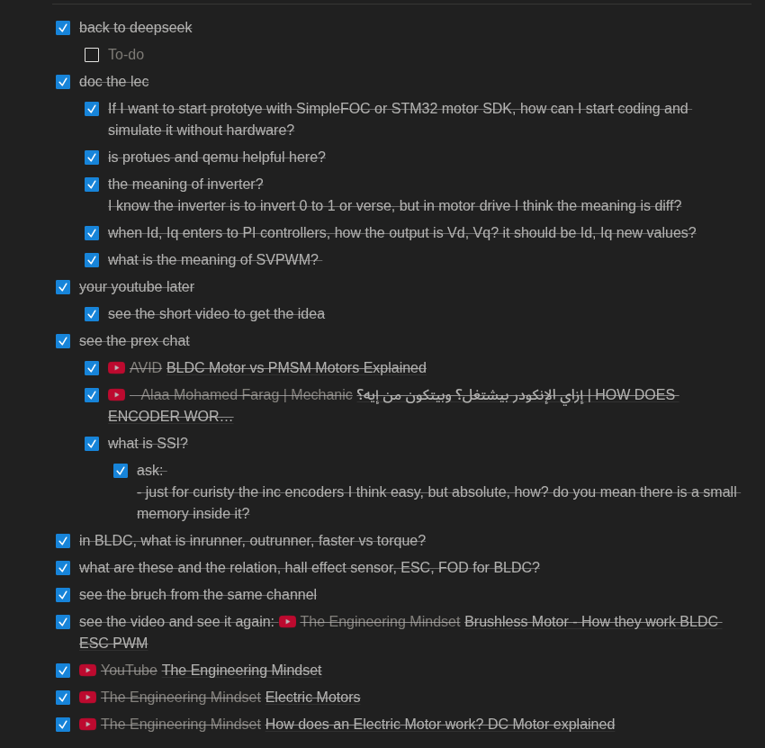

# 31-5-2026

# FOC ESC 
- **This is't full project, just I am learning how to impl the FOC to understand it more**
- This project for control BLDC motor by FOC ESC (Field-Oriented Control Electronic Speed Controller)
- After that, I can use ready impl Lib (SimpleFOC or motor control SDK from ST) or continue my FOC impl
-  
## What I know before the task
- I know basics about motors but I can control it according to its speed, didn't work before with torque control
- 
## What I did/learned to start the task
- 
- this is my list that give me an overall knowledge about what is the problem!
-  I have know more about motors and BLDC
-  Six step ESC then FOC ESC
-  the ready use Lib (SimpleFOC or motor control SDK from ST and ...)
-  the math of FOC (I didn't go deep, but have overall knowledge)
-  encoders (I didn't work with it before)
-  SSI (I know it, but still I want to learn it more)
-  SPWM, SVPWM (this is very intersting point but still I want to make sense with it)
-  the control block diagram of FOC, and you will see it in the repo and I follow it
-  
## What is structure now
- every progress is a Git branch, the final foc, in *foc_logic branch*
- there is application dir: contains the app logic
- there is foc_logic: has all foc logic (abstract from the hardware)
- HAL: will have the hardware specific code (MCU interface, encoder, SSI, ADC, ...)
- 
## What is the code/progress/structure now
- I have impl FOC logic (in foc_logic branch) in abstracted structure
- I have impl a simple motor_model
- I have tested the FOC math logic with the motor_model
- I have tried many PI tuning and some improvemnts to make the results acceptable (not accurate like a real HW but the results working in a noraml way, with error_q near to 0 in most of records)
- There csv file, to see the simultion results
- 
## What next?
- now the foc logic reach a good point
- learn more about the MCU target, I assumed we will work with STM32F401 (has FPU)
- the next to me is, work with interface of encoder, SSI, ADC, PWM and build abstracted API/interface
- after building the HAL interface, I will start to intergrate unit by unit and tune it to work Insha'Allah
- 
